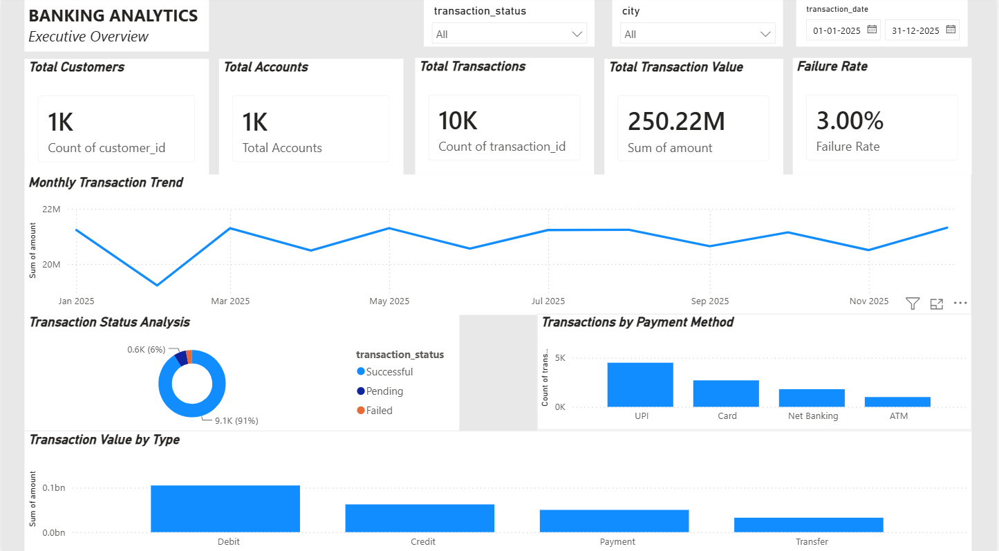
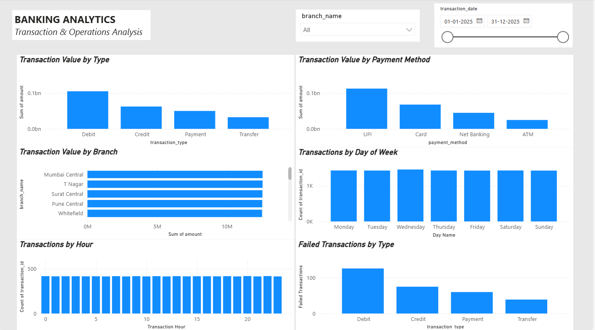
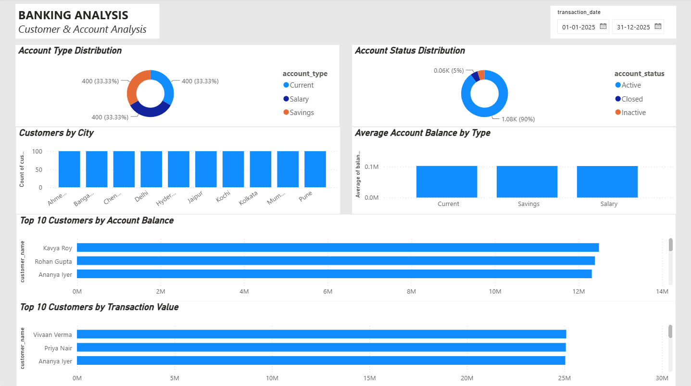

# Banking Analytics Dashboard

A banking analytics project built using **SQL, Power BI, and Excel** to analyze customer accounts, transactions, payment methods, transaction failures, and overall banking activity.

## Project Overview

This project analyzes a synthetic banking dataset containing customer, account, branch, and transaction information.

The goal is to turn raw banking data into useful business insights through **SQL analysis and an interactive Power BI dashboard**.

## Business Objectives

* Analyze overall transaction performance
* Understand transaction trends over time
* Compare transaction types and payment methods
* Identify failed and pending transactions
* Analyze customer and account activity
* Compare account types and account statuses
* Identify top customers by account balance and transaction value
* Analyze transaction activity by branch, day, and hour

## Tools Used

* **SQL / MySQL** — Data analysis and querying
* **Power BI** — Interactive dashboard and visualization
* **Excel** — Data preparation and management
* **GitHub** — Project documentation and version control

## Dataset

The project uses a **synthetic banking dataset generated directly in MySQL Workbench**.

The database contains four main tables:

* **Customers** — customer details such as name, gender, age, city, and signup date
* **Branches** — branch name, city, and region
* **Accounts** — account type, opening date, balance, and account status
* **Transactions** — transaction date, type, amount, payment method, and transaction status

The generated dataset contains:

* **1,000 customers**
* **1,200 accounts**
* **10,000 transactions**
* **20 branches**

The data was generated using SQL with recursive CTEs and deterministic logic, allowing the project to be reproduced directly in MySQL Workbench.

## Project Structure

```text
banking-analytics-dashboard/
│
├── README.md
│
├── powerbi/
│   ├── .gitkeep
│   └── Banking_Analytics_Dashboard.pbix
│
├── screenshots/
│   ├── .gitkeep
│   ├── executive_overview.png
│   ├── transaction_analysis.png
│   └── customer_account_analysis.png
│
└── sql/
    ├── 01_create_database.sql
    ├── 02_create_tables.sql
    ├── 03_data_cleaning.sql
    └── 04_analysis_queries.sql
```

## Dashboard

The Power BI report contains three pages.

### 1. Executive Overview

Provides a high-level view of banking activity using KPI cards and transaction analysis.

Key metrics include:

* Total Customers
* Total Accounts
* Total Transactions
* Total Transaction Value
* Failure Rate

It also includes:

* Monthly transaction value
* Transaction status
* Payment method analysis
* Transaction value by type



### 2. Transaction & Operations Analysis

This page focuses on transaction behavior and operational patterns.

Analysis includes:

* Transaction value by type
* Transaction value by payment method
* Transaction value by branch
* Transactions by day of week
* Transactions by hour
* Failed transactions by type



### 3. Customer & Account Analysis

This page focuses on customers and accounts.

Analysis includes:

* Account type distribution
* Account status distribution
* Customers by city
* Average account balance by account type
* Top 10 customers by account balance
* Top 10 customers by transaction value



## Key Insights

The dashboard provides the following high-level insights:

* The dataset contains **1,000 customers** and **1,200 accounts**.
* The dashboard analyzes **10,000 transactions**.
* The total transaction value is approximately **₹250.22M**.
* The overall transaction failure rate is **3.00%**.
* The dashboard provides analysis of transaction types, payment methods, transaction status, branches, customers, accounts, and time-based transaction activity.
* Transaction activity can be analyzed by **month, day of week, and hour** to identify operational patterns.
* Customer and account analysis provides insights into account types, account statuses, customer locations, account balances, and high-value customers.

## SQL Analysis

SQL was used to analyze:

* Transaction volumes
* Transaction values
* Transaction status
* Payment methods
* Transaction types
* Branch performance
* Customer activity
* Account distribution
* Failed transactions
* Time-based transaction patterns

The SQL scripts are organized in the `sql` folder.

## Skills Demonstrated

* SQL querying
* Data cleaning
* Data aggregation
* KPI development
* Exploratory data analysis
* Business analysis
* Power BI dashboard development
* Data visualization
* Interactive filtering
* Business insight generation

## Project Outcome

The project demonstrates how raw banking data can be transformed into an interactive analytical dashboard that helps users understand **transaction performance, customer activity, account distribution, payment behavior, and transaction failures**.

## Author

**Tanmayee Chakraborty**
